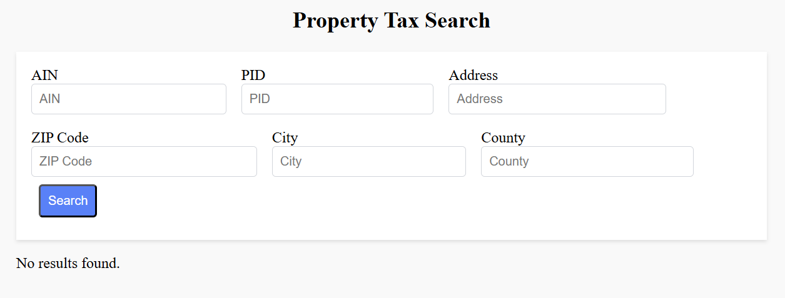

# Property Tax Lookup

A web application to search and lookup property tax information from a database of 24,000+ properties.

## Features

- 🔍 Search properties by AIN, PID, Address, ZIP Code, City, County
- 💰 View estimated property tax information
- ⚡ Fast search with real-time results
- 📱 Responsive design

## How to use (Website)
- Go to https://property-tax-lookup.vercel.app/
- The website should have a UI like below

- If you want to search anything, hit `Search`
- If you want to get all information, clear all fields and hit `Search`


## Quick Start

```bash
# Or manually:
cd backend && node index.js    # Backend on :5000
cd frontend && npm run dev     # Frontend on :5173
```

## Tech Stack

- **Frontend**: React + Vite + Tailwind CSS
- **Backend**: Node.js + Express
- **Data**: CSV with 24,394 properties
- **Deployment**: Vercel

## API

- **Search**: `GET /api/search?city=Los Angeles&county=LA`
- **Parameters**: AIN, PID, Address, ZIP Code, City, County, Estimated Property Tax

## Deploy

```bash
vercel --prod
```

---
*Built with ❤️ for property tax research*
